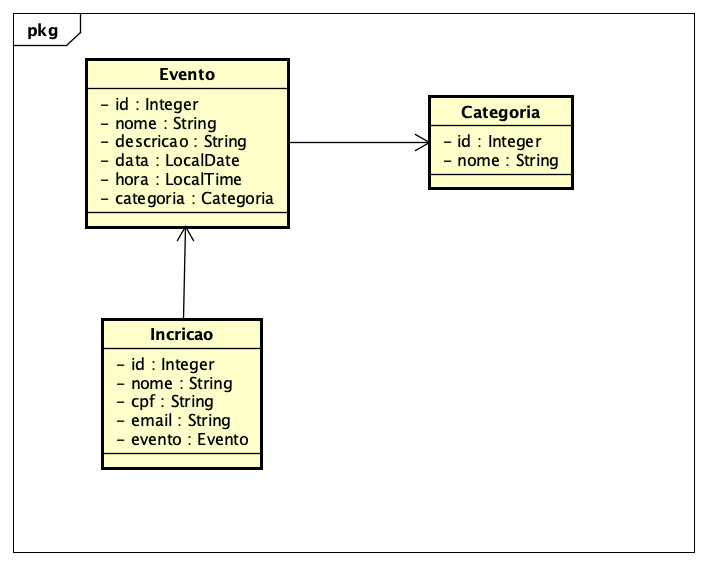

# EventUCSal - Sistema de Eventos da UCSal

## VERSÃO AVALIAÇÃO:

O código apresenta apenas o conteúdo visto na AVI:
* HTML
* CSS
* JavaScript
* Java
* Sevlets
* JSP
* JDBC
* MVC

O projeto esta no Eclipse e esta usando o banco de dados HSQLDB em memória. Não há nenhuma necessidade de alterar a classe __Conexao.java__

* 'Caso deseje alterar é por sua conta e risco.'

Como requisitos funcionais foram definidos:

- [X] 1. Lista de Eventos.
- [X] 2. Cadastro de Eventos.
- [X] 3. Exibir Evento.
- [ ] 4. Alterar o Evento para que o evento tenha uma categoria.
- [ ] 5. Cadastro de Categorias (Feira, Musical, TI ).
- [ ] 6. Formulário para inscrição em evento
- [ ] 7. Listar inscritos no Evento

Para ajudar um diagrama de classes do projeto:



Atualmente o sistema está cadastrando e listando os eventos.

## ALTERAÇÕES NECESSÁRIAS

Agora que o usuário já pode cadastrar e listar os eventos ele gostaria de fazer uma incricrição para um determinado evento.

Outra alteracão é podeder classificar os eventos por categoria.


Restrições:
* Não permita que sejam criadas 2 inscricões para um evento com o mesmo cpf ou email.
* Não permita 2 categorias com o mesmo nome.

Sugestão de Caminho:
- [ ] CRIE O FORMULÁRIO DE CATEGORIA (JSP)
- [ ] CRIE O MODEL DE CATEGORIA (JAVA)
- [ ] CRIE O CONTROLLER DE CATEGORIA (JAVA)
- [ ] CRIE O DAO DE INSCRIÇÃO (JAVA)
- [ ] CRIE O CONTROLLER DE INSCRIÇÃO (JAVA)
- [ ] CRIE O FORMULARIO DE INSCRICAO (JSP)
- [ ] IMPLEMENTE A RESTRIÇÃO (JAVA)

DICAS:
Use o Tipo java.time.LocalDate para data
Use o Tipo java.time.LocalTime para hora inicio e hora fim

### Conversão

```Java


//Obtendo do Banco um java.sql.Date e convertendo para java.time.LocalDate
r.setData(rs.getDate("data").toLocalDate());
//Obtendo do Banco um java.sql.Time e convertendo para java.time.LocalTime
r.setHoraInicio(rs.getTime("hora").toLocalTime());


//Convertendo de uma String "21/10/2017" para um java.time.LocalDate
//import java.time.format.DateTimeFormatter;
DateTimeFormatter dateFormat = DateTimeFormatter.ofPattern("dd/MM/yyyy");
String data = "21/10/2017";
r.setData(LocalDate.parse(data, dateFormat));

//Convertendo de uma String "13:59" para um java.time.LocalDate
DateTimeFormatter timeFormat = DateTimeFormatter.ofPattern("H:mm");
String hora = "13:59";
r.setHora(LocalTime.parse(hora, timeFormat));


//Convertendo de um java.time.LocalDate para um java.sql.Date para inserir no Banco de dados
ps.setDate(1, java.sql.Date.valueOf(r.getData()));

//Convertendo de um java.time.LocalTime para um java.sql.Time para inserir no Banco de dados
ps.setTime(2, java.sql.Time.valueOf(reserva.getHora()));

```


Para usar o novo esquema do banco basta remover as marcas de comentário da RESERVA.
